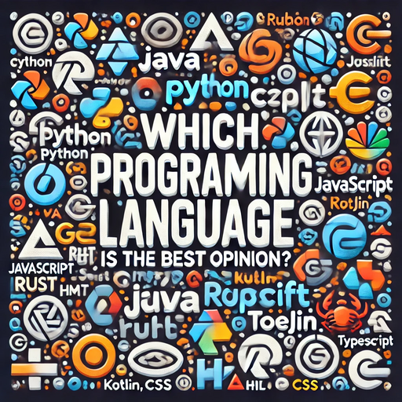

# The World of Programming Languages

In today's rapidly evolving tech landscape, **there are hundreds of programming languages**, each designed to solve different problems and cater to specific industries. From web development and data science to artificial intelligence and embedded systems, developers have a **wide array of choices** when it comes to selecting the right language for their projects.

However, **choosing the best programming language** can be overwhelming, especially for beginners. Should you go for a widely-used language like **Python or JavaScript**, or opt for something more specialized like **Rust or Swift**? The decision depends on factors such as job opportunities, project requirements, performance, and ease of learning.

To help you navigate this diverse landscape, we present **a ranking of the most popular programming languages** based on industry trends, developer preferences, and real-world applications. Whether you're a beginner or an experienced programmer, this ranking will provide valuable insights into the languages shaping the future of technology.

| Feb 2025 | Programming Language | Ratings | Change |
|:--:|:--:|:--:|:--:|
| 1 | [Python](subpages/Python.md) | 23.88% | +8.72% |
| 2 | [C++](subpages/C__.md) | 11.37% | +0.84% |
| 3 | [Java](subpages/Java.md) | 10.66% | +1.79% |
| 4 | [C](subpages/C.md) | 9.84% | -1.14% |
| 5 | [C#](subpages/C_.md) | 4.12% | -3.41% |
| 6 | [JavaScript](subpages/JavaScript.md) | 3.78% | +0.61% |
| 7 | [SQL](subpages/SQL.md) | 2.87% | +1.04% |
| 8 | [Go](subpages/Go.md) | 2.26% | +0.53% |
| 9 | [Delphi/Object Pascal](subpages/Delphi_Object_Pascal.md) | 2.18% | +0.78% |
| 10 | [Visual Basic](subpages/Visual_Basic.md) | 2.04% | +0.52% |
| 11 | [Fortran](subpages/Fortran.md) | 1.75% | +0.35% |
| 12 | [Scratch](subpages/Scratch.md) | 1.54% | +0.36% |
| 13 | [Rust](subpages/Rust.md) | 1.47% | +0.42% |
| 14 | [PHP](subpages/PHP.md) | 1.14% | -0.37% |
| 15 | [R](subpages/R.md) | 1.06% | +0.07% |
| 16 | [MATLAB](subpages/MATLAB.md) | 0.98% | -0.28% |
| 17 | [Assembly language](subpages/Assembly_language.md) | 0.95% | -0.24% |
| 18 | [COBOL](subpages/COBOL.md) | 0.82% | -0.18% |
| 19 | [Ruby](subpages/Ruby.md) | 0.82% | -0.17% |
| 20 | [Prolog](subpages/Prolog.md) | 0.80% | +0.03% |

    
Tip: Click the picture to find out which programming language is best in my personal opinion!
